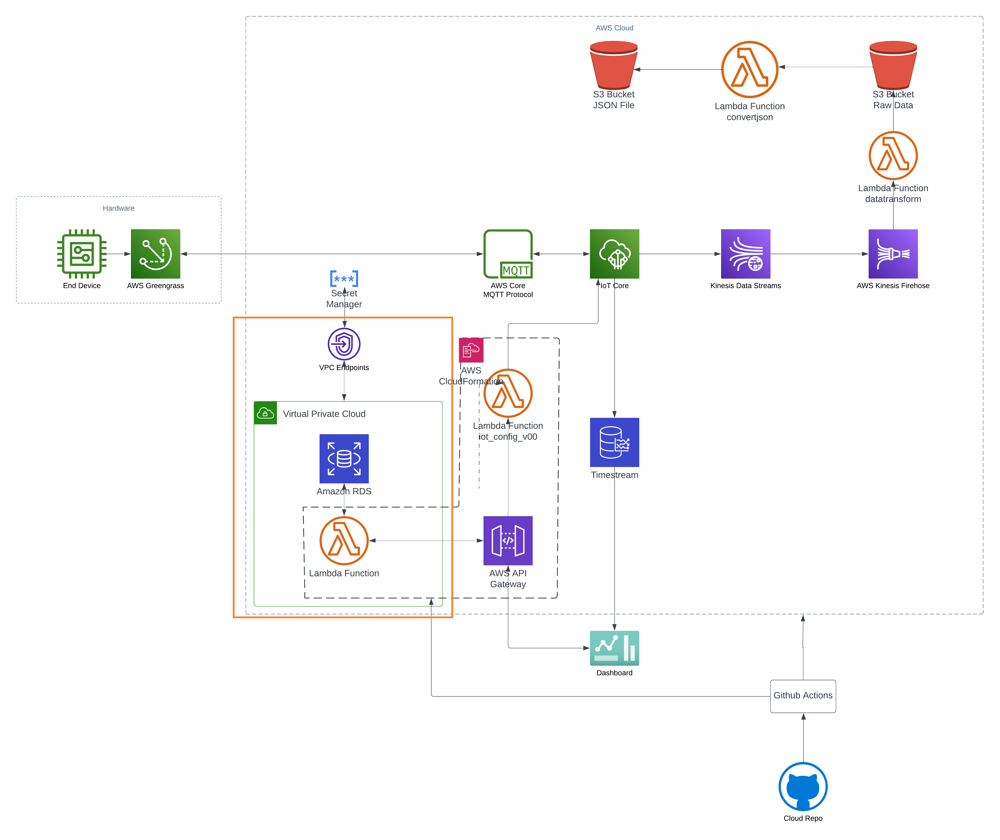

# AWS Virtual Private Cloud

## Overview
Amazon Virtual Private Cloud (VPC) offers a secured, virtual networking environment that allows the launch of AWS resources in a defined virtual network. In our design, the `yvr-configuration` database and Lambda functions used for API gateways are positioned within the VPC, adding an extra layer of security. A VPC Endpoint is utilized to securely connect our VPC to Secrets Manager, without exposing the traffic to the public internet. This strategy effectively leverages VPC's isolation to enhance data security and network performance.

## Current Usage
We use VPC to isolate our resources of DB and Lambda functions from the public internet and use VPC Endpoint to connect to Secrets Manager.

## Current Configuration
- **main route table and ACL**
  autometically generated in the creation of VPC
  
- **subnets**
  
- **security groups**
  

## Benefits

1. **Security**: By utilizing a VPC, our AWS resources, such as the RDS database and Lambda functions, are isolated in a private network space. We have complete control over the network configuration, including selection of our own IP address range, creation of subnets, and configuration of routing tables and network gateways. This significantly enhances the security of our data and application.

2. **VPC Endpoints**: With the use of VPC Endpoints, our Lambda function can securely access the Secrets Manager without needing to traverse the public internet, which minimizes the exposure to security threats.

3. **Scalability and Flexibility**: Using a VPC provides us with the flexibility to easily scale up or down based on our needs. For instance, as our data grows, we can adjust our VPC settings to allow more Lambda functions or increase the size of our RDS instance. Our VPC can be easily modified to suit the changing needs of our application or business.
   

## References

1. **VPCs and Subnets - Amazon Virtual Private Cloud**

   [https://docs.aws.amazon.com/vpc/latest/userguide/VPC_Subnets.html](https://docs.aws.amazon.com/vpc/latest/userguide/VPC_Subnets.html)

2. **Security Groups for Your VPC - Amazon Virtual Private Cloud**

   [https://docs.aws.amazon.com/vpc/latest/userguide/VPC_SecurityGroups.html](https://docs.aws.amazon.com/vpc/latest/userguide/VPC_SecurityGroups.html)

3. **VPC Peering - Amazon Virtual Private Cloud**

   [https://docs.aws.amazon.com/vpc/latest/peering/what-is-vpc-peering.html](https://docs.aws.amazon.com/vpc/latest/peering/what-is-vpc-peering.html)