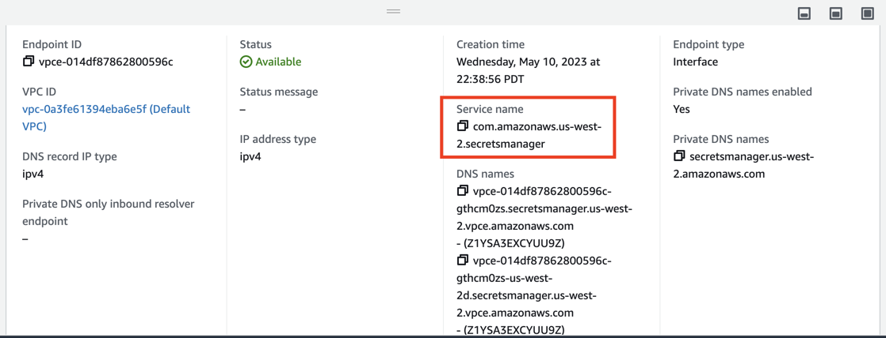
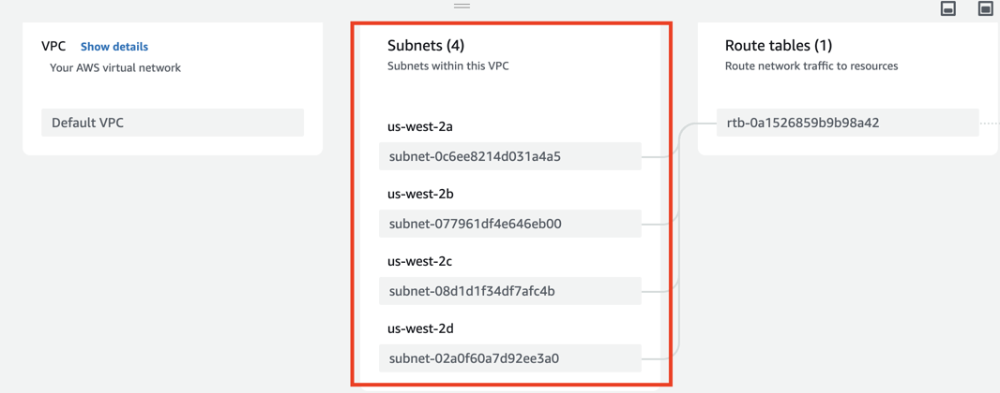
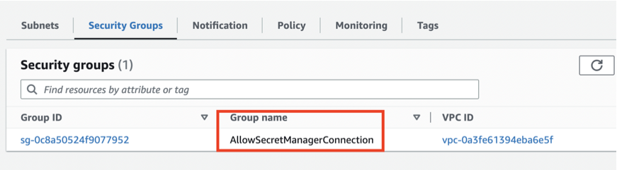

# VPC Endpoint

## Overview
A VPC Endpoint enables private connectivity between Virtual Private Cloud (VPC) and supported AWS services. It routes data within the AWS network, avoiding the public internet, which enhances security and privacy. 

By using VPC Endpoints, we reduced data transfer costs, enhance security, and improve the reliability and performance of communication between the VPC and AWS services.

## Current Usage
We created Interface Endpoints powered by AWS PrivateLink, to provide private connectivity to AWS Secret Manager, from our VPC 

## Current VPC Endpoint Configuration

- **service name**
  
    The service name has to be `com.amazonaws.us-west-2.secretsmanager` to connect to Secrets Manager in us-west-2 region.

- **subnets**
  

- **security groups**
  

  **Note**:
  This security group only allows HTTS traffic from the VPC to Secrets Manager using TCP protocol on port 443.

 