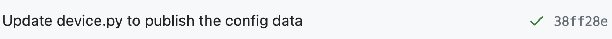

# CI/CD Pipeline

Previously, it was a manual process to deploy code changes to AWS.  For example, if developers would like to update the lambda function, they had to manually zip the code in their local machine, upload it to S3, and update the lambda function in AWS console.  Such process is not only inefficient,
but also error-prone.

To address this issue, we have set up a continuous integration and continuous delivery (CI/CD) pipeline to automate the deployment and updates of our AWS resources using GitHub Actions.  

## GitHub Actions

GitHub Actions is a CI/CD tool that allows us to automate, customize, and execute software development workflows directly in our GitHub repository.  It is integrated with GitHub, which makes it easy to set up and use.  It also provides a wide range of actions that can be used to build, test, and deploy our code.

Whenever code changes are pushed to the feature branches (i.e. branches that are not `main`), GitHub Actions workflow would be triggered to run the automated checks for the lambda functions and the CloudFormation templates.  If the tests pass, a green check mark would be displayed beside the commit on GitHub (example shown below), indicating that the code changes are good to be merged to the `main` branch.

Whenever code changes are pushed to the `main` branch of the `cloud-2023` repository, GitHub Actions will automatically run the defined workflows, which are described in the following sections.

### Update Lambda functions
Whenever code changes are made to any of the following lambda functions, a GitHub Actions workflow will be triggered to do the deployment.
- `yv-stage-user`
- `yvr-stage-device`
- `yvr-stage-calibration`
- `yvr-stage-emailnotifier`

The deployment process is as follows:
1. Zip the code with all dependencies, and upload the zip file to the S3 bucket `yvr-lambda-functions`.
2. Deploy the latest CloudFormation template to ensure the configuration of the lambda function is up-to-date.
3. Update the lambda function through CLI to use the latest version of the code in S3

### API Gateway
Whenever there are changes of the CloudFormation template that defines configurations of API Gateway `yvr-stage-api-gw`, a GitHub Actions workflow will be triggered to do the deployment.

### IoT rule
Whenever there are changes of the CloudFormation template that defines configurations of API Gateway `yvr_stage_iot_rule`, a GitHub Actions workflow will be triggered to do the deployment.