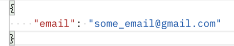

# Cognito API Endpoint

The purpose of this endpoint is to provide user info to the Dashboard's admin portal, along with user management.

AWS Console Info:

-	Link: https://bcit-iot-coc.signin.aws.amazon.com/console
-	Username: dashboard_admin 
-   Password: YVR_admin_1! 

Once logged into AWS, change the region to Oregon, go to Cognito, then “yvr” user pool

Note: Authorization (JWT token) is required for all endpoints

## GET ALL USER

-	Endpoint: https://c5hn9pagt5.execute-api.us-west-2.amazonaws.com/prod/user
-	Request:
    -   Header should include (Authorization: JWT token)
    -   GET Request
    -   No body required

-   Response:

## ADD A NEW USER

-	Endpoint: https://c5hn9pagt5.execute-api.us-west-2.amazonaws.com/prod/user
-	Request:
    -   Header should include (Authorization: JWT token)
    -   POST Request
    -   Body Required, include the following:
        -   Operation is “add”
        -   Email
        -   Password must be 8 characters minimum length
            -   At least 1 number
            -   At least 1 lowercase letter
            -   At least 1 uppercase letter
            -   At least 1 special character
        -   Role could either be “admin” or “user”

-   Example Request:

-   Example Response:

## UPDATE A USER

-	Endpoint: https://c5hn9pagt5.execute-api.us-west-2.amazonaws.com/prod/user
-	Request:
    -   Header should include (Authorization: JWT token)
    -   POST Request
    -   Body Required, include the following:
        -   Operation is “update”
        -   Old email
        -   New email
        -   Password must be 8 characters minimum length
            -   At least 1 number
            -   At least 1 lowercase letter
            -   At least 1 uppercase letter
            -   At least 1 special character
        -   Role could either be “admin” or “user”

-   Example Request:

-   Example Response:

## DELETE USER

-	Endpoint: https://c5hn9pagt5.execute-api.us-west-2.amazonaws.com/prod/user
-	Request:
    -   Header should include (Authorization: JWT token)
    -   POST Request
    -   Body Required, include the following:
        -   Operation is “delete”
        -   Email

-   Example Request:

-   Example Response:

## CHECK USER'S ROLE
*Note this endpoint is different from previous ones, have /role in the url path

-	Endpoint: https://c5hn9pagt5.execute-api.us-west-2.amazonaws.com/prod/user/role 
-	Request:
    -   Header should include (Authorization: JWT token)
    -   POST Request
    -   Body Required, include the following:
        -   Email

-   Example Request:

-   Example Response:

