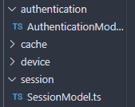

# Authentication and Session Management
Session and authentication functions are located in `session` and `authentication` related directories respectively.
{: .fs-6 .fw-300 }

## Authentication

To access the Dashboard, users must be logged in. Logging in will create a new user session.

## Sessions

Sessions are stored in our database and managed through cookies. Each session lasts 2 hours, after which it’ll expire unless refreshed. Expired sessions will be deleted once the user attempts to log in or access any pages.

In the future, if there are a large number of potential users, **we recommend writing a CRON job that does session pruning periodically** to delete expired sessions from the database.

## Authentication Middleware

Our APIs are **protected** with middleware which bars access unless properly authenticated, meaning that a valid session has to exist.

To set up authentication middleware for each route, make the modification on server.ts:

1. Import middleware from AuthenticationController

1. Add it to each route like so

Note that it may be helpful to not add middleware to a route while developing, just to make it easier to test APIs. However, each route except the authentication routes should be protected with this middleware.

## AWS JWT Token

In addition, a user’s session also includes a request to AWS to receive back a valid JWT token using the credentials and token secret which the SecretsManagerClient sends to the Gateway API. The user will receive a token back allowing for access to endpoints on the Cloud system. Currently, the endpoints are not protected by the AWS API but when the Cloud Team completes this feature, the request should include a role (’admin’ or ‘user’) to return the JWT for access to role-specified routes.