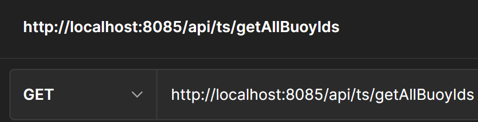
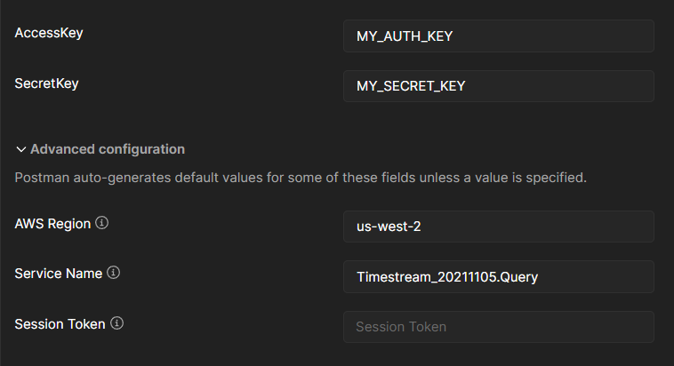

# AWS Timestream
The Timestream database is owned by the Cloud Team and provides a stream of smart devices data, real-time.
{: .fs-6 .fw-300 }

The AWS timestream is a server-less time series database optimized for IoT, edge, and operational applications. The pricing details are found at [AWS](https://aws.amazon.com/timestream/pricing/).

Of particular note is that **AWS does not charge by the amount of queries sent**; rather it is the **weight of the queries** that are considered for billing. The minimum size of a query is 10MB rounded to the nearest MB. 

Due to the fact that the timestream database is unidirectional (only accepting data from the device), the application needs to send SQL queries into the AWS cloud along with the credentials for the particular database and table. To achieve this, the application uses a custom query builder to build and package the query with credentials. Below is the implementation for the query builder which every request to the API uses to send AWS:

```jsx
// This function creates and initializes the query and querystring objects.
// Returns an array to be destructured into the seperate objects.
const createTSQuery = (
  queryString: string,
  clientToken?: string,
  maxRows?: number,
  nextToken?: string
): any => {
  //Configure the region
  AWS.config.update({ region: queryInfo.REGION });
  //Create credentials
  const credentials = new Credentials({
    accessKeyId: `${process.env.AWS_API_ACCESS_KEY}`,
    secretAccessKey: `${process.env.SECRET_ACCESS_KEY}`,
  });
  //Create the query object
  const timeStreamQuery = new TimestreamQuery({
    apiVersion: queryInfo.API_VERSION,
  });
  //Configure the query objects using credentials.
  timeStreamQuery.config.update({
    credentials,
    region: queryInfo.REGION,
  });
  //Create the query object.
  const queryParams: QueryParams = {
    ClientToken: clientToken,
    MaxRows: maxRows,
    NextToken: nextToken,
    QueryString: queryString,
  };
  //Pack query and query string objects into array.
  return [timeStreamQuery, queryParams] as const;
};
```

Note that clientToken, maxRows, and nextToken are values that can be used to optimize queries for example through scheduled queries that are run at intervals. The optimization will be left to the incoming teams to implement.

## Endpoints

Please refer to the [Timestream API Documentation](https://www.notion.so/Timestream-API-Documentation-2a69a46fc3934a60933c6852290c6b2e) for a detailed list of endpoints and how to use them properly.

## Setting up testing with Postman

First when testing locally, download the Postman desktop application found [here](https://learning.postman.com/docs/getting-started/installation-and-updates/#installing-postman-on-windows).

Once the download and installation is complete, open a new collection and create a new request by specifying the type of request and the endpoint like so:



Next click on the Auth tab and select AWS signature.

The token to verify the request to AWS is automatically generated by the query client. Therefore, you only need to specify the following values in the authentication for requests:



Note:

- Replace AccessKey and SecretKey values with the API keys for AWS
- Service name follows the following pattern:
    - `<Service Name> + _ + <API Version> + <operation name>`
- The latest values for AWS Region, Service Name and API Version are specified in queryInfo.ts.
- The Session Token is automatically generated for the query call, however this value can be set if the API implements query scheduling. For our purposes, we leave it blank
