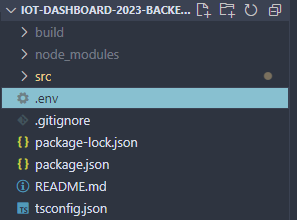
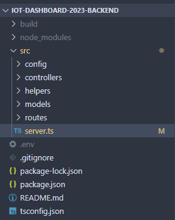
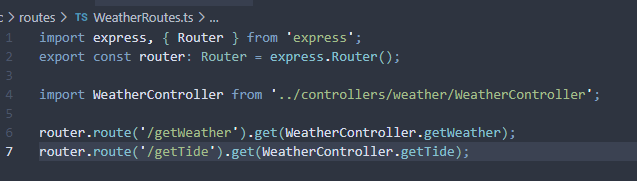
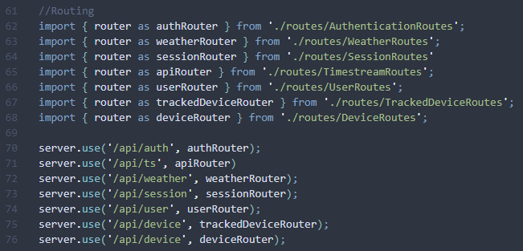
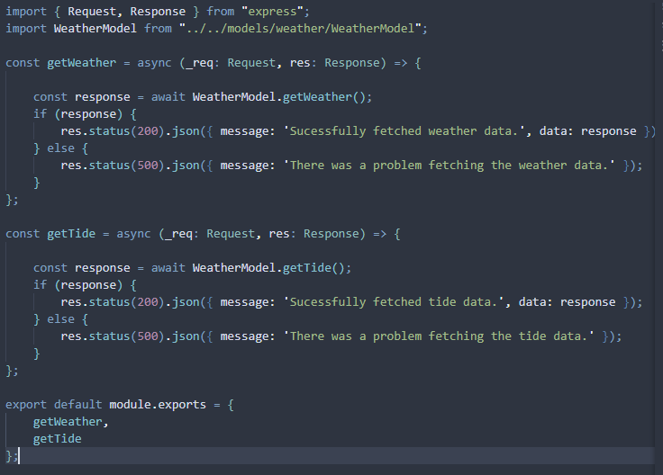
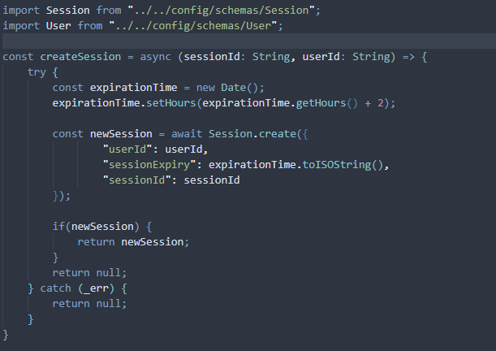

# Back-end/Server Architecture

## Server Design Overview

We use the **MVC pattern** in our server design in order to construct **REST API**s. All our REST APIs must be **Level 2** or above as quantified by the [Richardson REST Maturity Model](https://blog.restcase.com/4-maturity-levels-of-rest-api-design/). 

In order to test our APIs, we use **Postman**, although as we move closer to production a unit test tool like Thunderclient can be leveraged as well. 

## Environment Variables

<aside>
💡 **Do not** expose these .env keys publically including on Github for security reasons!

</aside>

The project’s environment variables are kept in `.env` in the root directory. This file is added in `.gitignore` — **do not** share this file online or with anyone outside the project.

You must create the file locally at the root level of the repository.



The previous Dashboard team will provide the keys via a document in an email. Copy and paste the keys into your file.

## Back-end Repository Structure

The way that our server is set up is based on **Movel-View-Controller** design. 

<aside>
💡 We want to think: **Routes** (direction) → **Controllers** (validation) → **Models** (logic)
Likewise, the ***reverse*** is true for data coming ***from*** the server.

</aside>

Here is a top level overview of the back-end repository. We will be going over the purpose of each directory and how they relate to the server architecture.



### Routes

**Routes** are how we specify our endpoints. A route provides a function for each endpoint.



This is an example of routing that was created for endpoints related to weather and tide related APIS. There are two routes in this file, `/getWeather` and `/getTide`, which both point to identically named functions in the imported `WeatherController`. We can also see that they’re both `GET` requests.

Generally, we want to name our routes to clearly reflect the purpose of the API.

In order for the server to read these routes, they must be imported and added to `server.ts`



As we can see on line 63, the `weatherRouter` is being imported from `./routes/WeatherRoutes`. We are then calling it with `server.use('/api/weather', weatherRouter)` in line 72. This must be done with each router. 

The full endpoint for any endpoint in weatherRouter is this concatenated with `/api/weather`, e.g. `/api/weather/getTide`

### Controllers

**Controllers** are there to validate the data we are receiving from the client. We want all this data to be in the correct format before we process it with the model. Each Controller, after validating the request, calls the **Model**, which is where all business logic happens. The Controller also validates this response, and if it is valid, sends it to the Route.

Essentially, the Controller is the intermediate between Routes and Models. Here is the Controller for the Routes we looked at in the Routes section.



Generally, we want to follow a code structure like this:

```tsx
import { Request, Response } from "express";
import ExampleModel from "../../models/orders/ExampleModel";

const exampleControllerFunction = async (req: Request, res: Response) => {

    const { var1, var2 } = req.body; // or however you want to parse the request
		
    if (!var1 || !var2) {
				// if we're missing the params we need from the body, then return a 400 error
        res.status(400).json({ message: "Invalid request body." });

    } else {
				// await the model handling
        const response = await ExampleModel.exampleModelFunction(var1, var2);

        if (response) {
						// our model will return null (or false) if there was a problem processing it
						// if we have a response, then we send it with a 20* status code and whatever
						// data we need to give back to the client
            res.status(200).json({ message: 'Model returned a valid response.'});
    
        } else {
						// if our model throws an error, we send back a 50* status code or 
						// any other status(es) as needed.
            res.status(500).json({ message: 'Model returned an invalid response.' });
        }
    }

};
```

All Controller functions are exported as a **combined module**.

### Models

**Models** contain all our logic, for example: a DB transaction, a call to a 3rd party API, or a query to another server. All this, as well as the steps to restructure our data, should happen in this part of the server. 

At this point, we assume that **all the arguments we receive are valid format as far** as possible, due to the handling from the Controllers. However, we still need to see if they yield any results — it is very much possible that arguments recognized as valid by the Controllers may not be recognized as valid by the APIs called by the Models. **This is why we need to always wrap all our Model code in `try/catch` blocks**.

Here is an example of a Model function that updates the Session collection in the database. 



Generally, we want to follow a code structure like this:

```tsx
const exampleModelFunction = async (var1: String, var2: String) => {
    try {
        // do logical stuff here

        const response = await Schema.create({
                // whatever it is you need to do
        });

        if(response) {
            return response; // or any true/truthy value
        }
        return null; // or any false/falsy value
    } catch (_err) {
        return null; // or any false/falsy value
    }
};
```

All Model functions are exported as a **combined module**.

