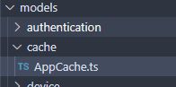
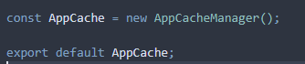

# Cache



**Caching strategies** are an integeral part to our back-end design. With caching, we are able to make signifigant improvements on **performance speed** as well as **reduce or eliminate costs**, particularly since the Dashboard depends on data from AWS and a other proprietary APIs (e.g. stormglass.io) Costs are calculated on a volume basis, so we understandably, need to offset that as much as possible. 

Caching does come at the expense of memory, so *be aware* of what you *need* to cache. Don’t just throw everything in cache or you’ll just make your server slower (and possibly more expensive, defeating the purpose of caching!)

The Dashboard’s cache is exposed as a **singleton.** There is only one cache active at any time on server deploy.



To activate the cache, **these lines must be commented in** on `server.ts`

```tsx
// Cache
import AppCache from './models/cache/AppCache';

...

server.listen(port, async () => {

    // Register cache
    const registration = await AppCache.registerTideCache();
    if (!registration) {
        console.log('There was a problem populating the tide data cache. Check your query limits.');
    } else {
        console.log('Populated cache.');
    }
   ...
});
```

**IT IS VERY IMPORTANT TO NOTE**: we only get 5 queries to stormglass.io per day on their free plan. Comment out `AppCache.registerTideCache()` when developing unless there is work that needs to be done on it.

## Caching Strategy

The way we are caching is pretty straightforward. Since we have a singleton AppCache object, we can retain state and run timed queries. 

In AppCacheManager, we have private variables that represent **the data being cached** and the t**imer that we are using to refresh the data.**

Generally, we want to follow a code structure like this:

```tsx
// the data being cached
private cachedSampleData: rawSampleDataType[] | null;

// timer that refreshes the cache
private sampleInterval: NodeJS.Timer | null;
```

We initialize everything to `null` in the constructor since nothing’s been fetched at that point.

```tsx
constructor() {
        this.cachedSampleData = null;
        this.sampleInterval = null;
    };
```

For everything we cache, we need to define (at the very minimum) the following 3 methods within our class:

- `public getSampleData` → a getter to get the cached data
- `public registerSampleCache` → a method to register the cache
- `private fetchSampleData` → a method to fetch data from source

**public getSampleData**

This is simply a getter that returns the cached data.

Generally, we want to follow a code structure like this:

```tsx
public sampleGetter = async () => {

        if (!this.cachedSampleData) {
            await this.fetchSampleData();
        }

        return { 'sampleData': this.cachedSampleData};

    };
```

**public registerSampleCache**

This method is used to register the cache, that is, populate it. We create a NodeJS timer object that gets stored in the class, that refreshes based on a specified refresh rate. After that time, the specified endpoint will be called again, updating the cache’s state.

Generally, we want to follow a code structure like this:

```tsx
readonly sampleRefreshRate = 18000000; // 5 hours

...

public registerSampleCache = async () => {

        const sampleData = await this.fetchSampleData();

        if (sampleData) {
            this.cachedSampleData = sampleData;

        } else {
            return null;
        }

        this.sampleInterval = setInterval(async () => {

            const refreshedSampleData = await this.fetchSampleData();

            if (refreshedSampleData) {
                this.cachedSampleData = refreshedSampleData;
            }

        }, this.sampleRefreshRate);

        return this.sampleInterval;
};
```

**private fetchSampleData**

To update the cache, we will need some way to fetch data to populate it. This is simply a method(s) that fulfills this purpose.

We would advise against doing any manipulation methods within the cache, as it violates the open-close principle, unless dealing with a large volume of raw data. Try to move logical functions within Models instead.