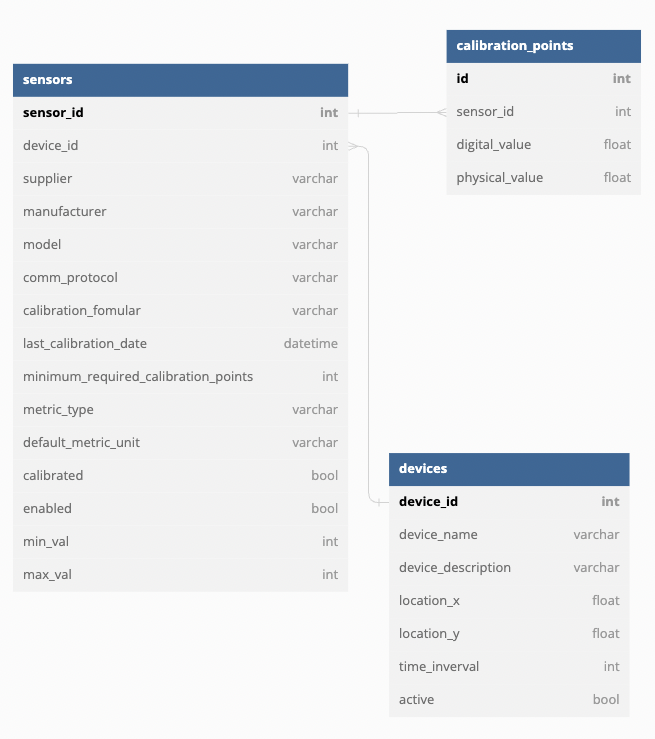
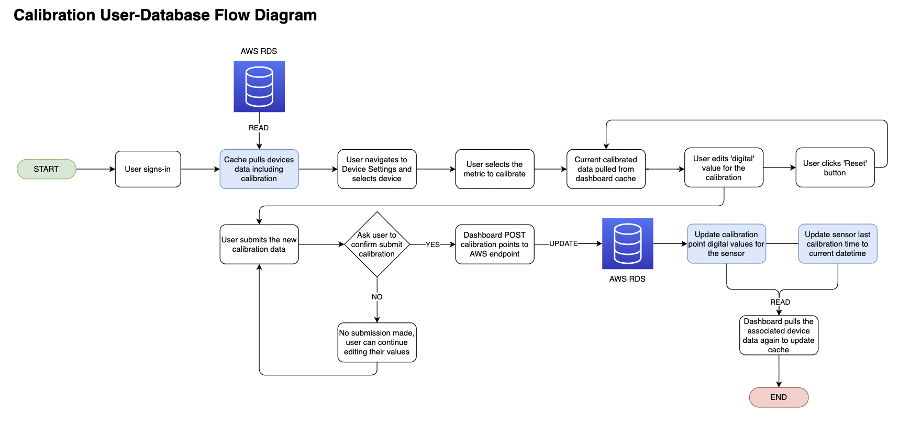

# Device, Sensors, & Calibration
The three models are stored on AWS RDS and managed by the Cloud team.
{: .fs-6 .fw-300 }

Each Device's configurations (settings), their sensors, and calibration points are stored and retrieved from [AWS RDS](/docs/cloud/RDS), managed by the Cloud team.

The following is the cloud schema as of May 22, 2023.

* A device can have any number of sensors attached
* Each sensor only belongs to one device
* Each sensor may have any number of calibration points. Ex. The water flow sensor of a device may have 3 total calibration points while the pH level sensor of the same device may only have 2.

Given that the database and AWS API is owned by the Cloud team, this documentation will continue by explaining how the user flow works on the dashboard for updating calibration points.

# Calibration Workflow

At the time of writing, the calibration feature has been slated for future implementation and release, however, there is a general idea of how the calibration workflow may be like on the Dashboard end. Below is a diagram of a possible implementation of calibration.

Given that this feature has not started implementation and only has a front-end layout, future teams may take inspiration from this flow chart, or depart from it entirely with a different design as desired.

