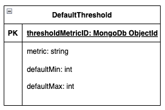
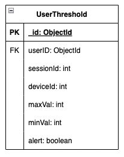
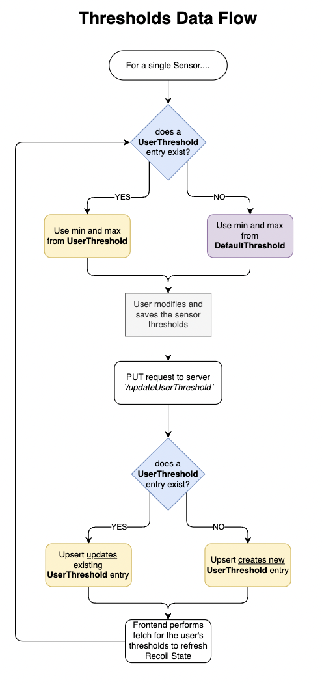
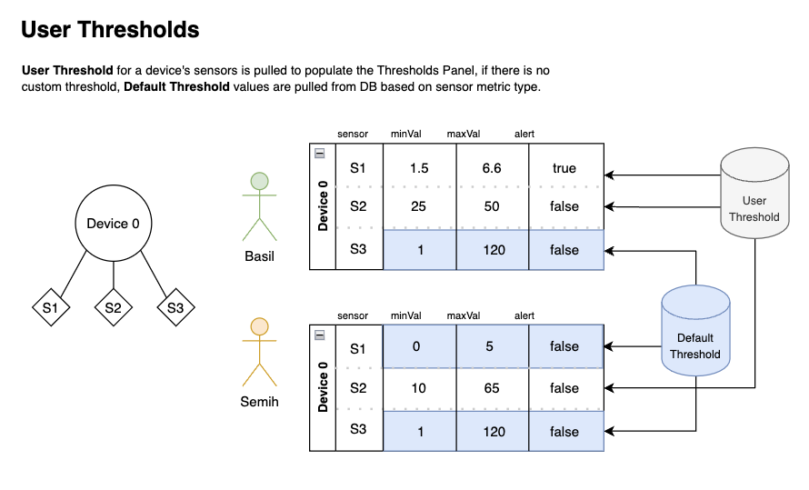

# Thresholds
Thresholds are values used for the alert system. 
{: .fs-6 .fw-300 }

Users may want to receive alerts for requested metrics from requested devices if these metrics are belowa minimum or above a maximum value. The results of comparing metric measurements to these thresholds will determine whether or not an alert for a given sensor should be sent to the user from the application. There are 2 collections related to thresholds in the database; `defaultThresholds` and `userThresholds`.

Some terms used in this document:

**Metric**: A metric type that is being measured by a sensor. For an example, water pressure, pH levels, turbidity.

**Alerts**: A feature that is part of the application to alert a user when certain thresholds are detected by a given sensor's realtime data. The user may choose to turn alerts on or off for any specific sensor of a device.

**Thresholds**: Indicate minimum, maximum values for a sensor.

## Default Thresholds

| Attribute   | Type    | Description                                       |
|---          |---      | ---                                               |
| metric      | string  | The metric type, using the existing metric codes. |
| defaultMin  | number  | The minimum default threshold value.              |
| defaultMax  | nubmer  | The maximum default threshold value.              |

For each metric that can be measured by devices within the scope of this project, a minimum and a maximum threshold value is designated. If users don’t want to or have not yet designated their own threshold values, they can use these default values to receive alerts for the metrics they want from the device they request. 

The main purpose of default thresholds is to give YVR the ability to control alert system triggers based on their priority when evaluating metrics from devices.

|💡 There is currently no frontend or backend implementation for this model to update or create new default threshold values. A possibility of improvement in the future is setting up CRUD operations for default metric thresholds for 'admin' roles. |

## User Thresholds

| Attribute   | Type                   | Description                                      |
|---          |---                     | ---                                              |
| userId      | FK - userId: ObjectId  | The user's document ID from the User table       |
| sensorId    | int                    | The sensor's ID as retrieved from AWS RDS        |
| deviceId    | int                    | The device's ID as retrieved from AWS RDS        |
| maxVal      | number                 | The maximum threshold alert value as set by the user.        |
| minVal      | number                 | The minimum threshold alert value as set by the user.        |
| alert       | boolean                | If user wants to be alerted for this sensor based on the set thresholds. `true` if alerts on, `false` if alerts off.        |

Users can set custom threshold values to receive alerts. They can designate minimum and maximum threshold values for each sensor attached to a device. These customized threshold values for each user and each device they track is stored in “userthresholds” collections with users’ choice of receiving an alert for each metric.

## How Thresholds Work

So, how does it all work? How user thresholds and default thresholds are used on the frontend is mapped by the flowchart diagram below:

1. Upon navigating to the Device Manager page, a background fetch is made to retrieve default thresholds for all metrics.
2. When a user opens a device's settings modal, a fetch is called to retrieve the user's custom thresholds.
3. In the thresholds/alerts panel, each column is compiled by evaluating the following:
* If the a user threshold exists for the user x sensorID, use the user's custom threshold data
* If there is no user threshold for the user x sensorID, use the default threshold for the sensor's metric type. The default alert value is `false` to keep the alert off.
4. Once the user makes any changes to a row in the threshold/alerts panel and saves the changes, either the existing UserThreshold value for the user x sensorID entry is updated, or a new entry is created for the user x sensorID of the row.

## Alert Thresholds are not Global
Based on the current design, Alert thresholds are custom for each user. That is, each user may have different minimum, maximum, and alert values for each existing sensor on any given device. Thus, every entry in the UserThresholds table has a unique `userID + sensorID` index (no duplicate entries with the same userId and sensorID can exist).

In the above diagram, Basil and Semih have different values for sensor 2 (S2) of device 0. Given that Basil does not have a custom user threshold for S3, the values are populated from Default Threshold. Semih does not have custom thresholds for S1 and S3, thus, the threshold values are also taken from Default Threshold.

