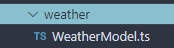

# Weather & Tide

Weather data is fetched from [weatherapi.com](http://weatherapi.com).

Tide data is fetched from [https://stormglass.io/](https://stormglass.io/) — note that this is **not** a fully free service, and capped at a rate of **10 calls a day** on their free plan. To circumvent this, we use a caching strategy and refreshing it every 5 hours, detailed below.

The access to both Weather API and Storm Glass accounts is set up using the YVR dashboard Gmail. Developers who are working on this project should have received the account information at the start of the project.