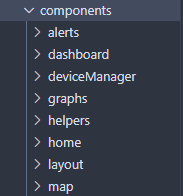

# Components
{: .no_toc }
Some specific components to take note of.
{: .fs-6 .fw-300 }



All individual components live in this folder, and are categorized according to either their parent page or any other common function (e.g. layout). These are broken down into further sub-directories as needed, for example, in the `dashboard` folder.

There are many components which are fairly self-explanatory, so here, **we will only expand on some specific ones of note within documentations.**

## Table of contents
{: .no_toc .text-delta }

1. TOC
{:toc}

---

# BaseLayout

This component can be found in `/src/components/layout/BaseLayout.tsx`

`BaseLayout` is a wrapper component which all the pages use. The purpose of this component is to act as a way to integrate `react-hot-toast` with every page through the `<Toaster>` component, as well as allow the sidebar to be hidden or visible as needed.

It may be of importance to explain a common pattern we use in our client, similar to a **decorator** (that is, we use a series of wrappers based on this design pattern).

## Wrappers

To create “decorators” or **wrapper** components, we use this prop:

```tsx
type wrapperProps = {
    children?: React.ReactNode;
};
```

The component will look something like this:

```tsx
const WrapperComponent: React.FC<wrapperProps> = ({ children, ... }) => {
    return (
        <>
            ...
				{children}
        </>
    );
};
```

This allows us to have some control over whether or not we render specific children; for example in the `<BaseLayout>` component, we render the sidebar based on the `isNavbarVisible` prop.

---

# BaseCard and BaseCardLoading

This wrapper component should be used for all cards, and draws a border around its children. For loading states, `<BaseCardLoading>` is a spinner that was made for these cards specifically. Render the `<BaseCardLoading>` component when the card is loading.

---

# Graphs

All the graphs in this project are made through third party libraries. `<AreaGraph>` and `<LineGraph>` are created with the [Recharts library](https://recharts.org/en-US/), while `<CircleGraph>` was made from [Chakra UI](https://chakra-ui.com/docs/components/circular-progress).

| 💡 Recharts’ `<ResponsiveContainer>` component has a bug where it **won’t render** if the width is set to 100%, hence width is set to **99%** on each of the charts where it’s used. |

---

# BaseTable

The `<BaseTable>` component was created from the `tanstack/react-table` library, which allows alphabetical and numerical sorting. 

| 💡 **DO NOT MODIFY** the `<BaseTable>` component. To make a new table for use, you must create columns that are then used by the `<BaseTable>`. See `Logs.tsx` for an example. |

Follow the general structure of the `<Logs>` component to create columns.

1. To start, create a type where each field represents a column in the table.

```tsx
type logDataType = {
    id: number;
    time: string;
    dissolvedOxygen: number;
    electricalConductivity: number;
    pH: number;
    turbidity: number;
    totalDissolvedSolids: number;
    temperature: number;
};
```

1. Create a hook using this type.

```tsx
const columnHelper = createColumnHelper<logDataType>();
```

1. Next, for each column, create a new cell in an array. The first argument in `.accessor` should correspond to the target field (e.g. the column name).

```tsx
columnHelper.accessor('id', {
            cell: ({ getValue }) => {
					// This function gets the value from the data being rendered
                const val = getValue<string>();
					// This is what gets rendered for each cell; additional components can 
				    // be embedded.
                return (<Text textAlign='center' fontSize={isLargeScreen ? 'md' : 'sm'}>{val}</Text>);
            },
				// The name of the column in the table's header row
            header: 'ID',
				// If the field is numeric or not - this is used when sorting
            meta: {
                isNumeric: true
            }
        })
```

| 💡 To disable sorting on a field, add the field `disableSortBy: true` as a field in the accessor object. This field **must be added** to avoid potential bugs with components living in the table (like buttons) which have no sortable value. |

1. Simply import `<BaseTable>` and add the columns and data as props.

```tsx
// The Box component allows the table to horizontally scroll
<Box overflow='auto'>
	<BaseTable columns={columns} data={mockLogData} />
</Box>
```

---

# Map

The map is built using [leaflet.js](https://www.notion.so/60046ece06624a9ca5fe23028a18f764) and [react-leaflet](https://react-leaflet.js.org/). React-leaflet acts as a wrapper for the leaflet library functions. You cannot have react-leaflet without leaflet so both are required. 

Here is an example of how the react-leaflet wrapper component works:

```jsx
<MapContainer
      id={mapId}
      doubleClickZoom={false}
      zoom={zoomVal}
      zoomSnap={zoomSet}
      center={center}
      // ref={setMap}
      zoomControl={false}
      bounceAtZoomLimits={true}
    >

		<TileLayer url={tilePath} />

</MapContainer>
```

## Rendering the Map

The leaflet library requires some extra steps for rendering the map visually. Here are some important considerations when using the leaflet library:

1. Base styles: 
    - The base styles of the map must be implemented, there are typically two approaches:
        - Root DOM method ☹️: Find a CDN link from the website and attach it at the root DOM (index.html)
        - Better method 🙂: import the styles you need into a stylesheet from the leaflet npm or yarn package to only be used by map component
    
    ```jsx
    @import '~leaflet/dist/leaflet.css';
    ```
    

This is cleaner and does not lead to potential stylesheet issues.

1. Fixed height:
    - A limitation of the library is that the container that holds the map must be set with a fixed pixel height; this makes implementing a responsive map a challenge. The width can be set with responsive values.
        
        [Sprints](https://www.notion.so/7d49577253c54fd99b55c586d40fa6c4)
        
    - The main reason for why the map needs a fixed height is because if the map is constantly resized the tiles that are provided to the map might not fit on the new page which leads to unexpected behaviors.
    - Therefore the intent behind a fixed map is to ensure that the map and map tiles are rendered correctly.
    - Here is the stylesheet implementation:
        
        ```jsx
        /* Important for react-leaflet map 
        			to load visually and connect css loaders to node modules.
            Also replaces the need to have the CDN link in index.html 
        */
        @import '~leaflet/dist/leaflet.css';
        
        #mapId {
          /* setting the height to % or rem 
        					will not render the map at all */
            height: 400px; 
            width: 80%;
            position: relative;
            border-radius: 0.5rem !important;
          }
        ```

