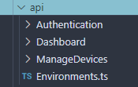

# API



All functions used to call APIs from the server live in this folder. The folders are usually categorized according to page. The `Environments.ts` file only contains the host URL at the moment, but can be used to contain other related variables.

In general we follow this pattern for all functions used to fetch APIs:

```tsx
const fetchFunction = async () => {
    try {
				
				// Call the API
        const response: any = await axios.get<any, AxiosResponse<string[]>>(`${API_URL}/endpoint`);
				
				// Check success status and return it if success
        if (response.status === 200) {
            return response.data;
        }
				
				// Else return a false/falsy value
        return null;

    } catch (_err) {
				// If error return a false/falsy value
        return null;
    }

};
```

All of these functions are exported as modules.
