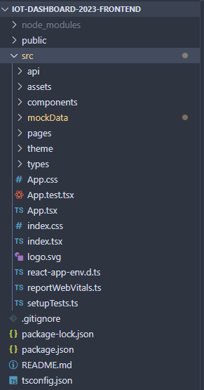

# Client Architecture
The Client (front-end) is built with React, TypeScript, Chakra UI, and Axios.
{: .fs-6 .fw-300 }

## Client Design Overview

The entire client is built with the **React framework**, and thus follows the React systems of [component-based design](https://legacy.reactjs.org/docs/design-principles.html). 

To put it simply, each page is a component of the application, and each page also consists of different components and subcomponents. We do not have a strict design pattern that we follow par se, aside from this.

---

## Front-end Repository Structure

Here is a top level overview of the front-end repository. We will be going over the purpose of each directory and how they relate to the client architecture.

| api/ | Contains modules/functions used to call back-end APIs. |
| --- | --- |
| assets/ | Contains static assets like fonts and graphics. |
| components/ | Contains all individual React components — .tsx files. |
| mockData/ | Will be removed in the future. Contains mock data temporarily being used. |
| pages/ | Contains all the “pages” of the application, wraps individual React components. |
| theme/ | Contains the Chakra UI theme. |
| types/ | Contains all global types — .d.ts files  |
| App.tsx | This file handles the application’s routing. Only modify to add more routes. |
| index.tsx | DO NOT MODIFY THIS FILE. This is the entry point for React scripts startup. |
