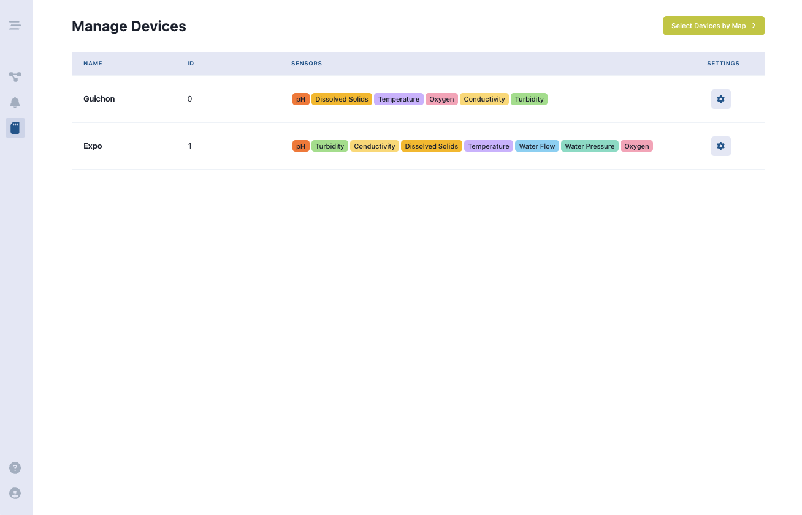
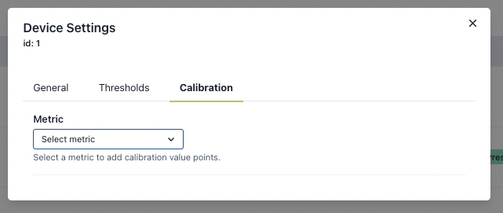

# Pages
{: .no_toc }
Application pages.
{: .fs-6 .fw-300 }


Pages are top-level/parent components that contain all the individual components in the `components` folder. 

## Table of contents
{: .no_toc .text-delta }

1. TOC
{:toc}

---

# Routing

All pages are accessible via URL. This is handled through `react-router-dom` and the routing is handled in the `App.tsx` file.


To add a new page, add an additional route within the `<Routes>` component.

```tsx
<Route path='/path' element={<Page />} />

```

---

# Dashboard


The Dashboard contains an overview of the environmental conditions around Sea Island, as well as data visualization for the data collected by the water monitoring devices. The Dashboard contains 3 tab panels, **Interval**, **Overview**, and **Logs**. 

On the left-hand side of the page, there are cards to show weather forecast, tidal predictions, and the locations of the devices on Sea Island.

## Intervals


The `<Interval>` panel uses the `<AreaGraph>` component to show how the measurements have changed over time across all metrics. Hovering over a graph will show more detailed information about the measurement at that point in time in a tooltip.

## Overview


The `<Overview>` panel shows how the current measurements are in relation to their historical maximums and minimums. The 0% of the `<CircleGraph>` represents the lowest point and 100% represents the highest point respectively.

We have a simple helper function to determine the color of the measurement.

| Danger | <10% or >90% |
| --- | --- |
| Warning | <30% or >70% |
| Normal | 30% to 70% |

## Logs


The `<Logs>` panel contains the data of all the measurements, but in tabular format. Clicking on the column headers sorts the data by that specific column. All the data can be exported as `.xlsx` by clicking on the **Download** button.

The functionality to export to Excel has all been set up, however, if this needs to be edited, the `remapDataForExport` function can be adjusted accordingly.

To change the name of the sheet, the string template here can be modifed.

```tsx
reformattedSheets[**`${sheetName} (${logData.length})`**] = logData.map((data) => {
...
```

To create more pages, multiple sheets have to be appended to the object created by the `remapDataForExport` function.

---

# Alerts

| 💡 **04/27/2023** — this page is mostly placeholder with mock data, and still requires development. |


The Alerts page is where system-wide alerts live. To expand on the functionality this feature needs:

- Alerts need to be sent when a measurement exceeds a critical threshold.
- Emails are sent to users who have that setting enabled.
- Alerts are displayed in a table where all users can see them, and include all relevant information like type of alert, metric, status (priority — this is optional as implementation details for writing this algorithm are unclear; it could potentially be custom set as well), and device attributes.
- There should also be an option to remove the alert from the table.

# Manage Devices



The Manage Devices page is the part of the application that allows the user to change the settings of a device. Each row in the manage devices page is the summary of a device, including dynamically generated sensor tags to show what types of sensors are avaialable on a given device.

By clicking the gear button on the very right of a given row, a modal for device settings pops up. This modal contains 3 panels:
1. General
2. Thresholds/Alerts
3. Calibration

## General Panel


| Setting | Description |
| ---     | ---         |
| id      | Listed right under Device Settings modal header, this is the device id as assigned in the AWS RDS database. |
| Name    | The device name, must not exceed 25 characters. |
| Device Status    | Signify if the device is active or inactive. |
| Description    | The device description. |
| Location    | A manually input longitude and latitude of the device for the map modal. |

## Thresholds/Alerts Panel


This panel is dynamically generated based on the sensors that the device is related to. To read more on how the panel is populated, see the server documentation on [Thresholds](/docs/dashboard/backend/thresholds).

A user can change threshold settings, then click the save button to save their changes.

| Column | Description |
| ---     | ---         |
| Metric      | The metric of a sensor. |
| Min    | The user's set minimum for the sensor. |
| Max    | The user's set maximum for the sensor. |
| Unit    | The unit that the number is in, this is a default unit as specified by the sensor configurations. |
| Alert    | A switch to turn on/off the alert. |

## Calibration

| 💡 **05/22/2023** The current calibration panel is operating only with mock data. A full back-end with API calls integrated with Cloud team's AWS RDS API must be completed. Read more about [Calibration](http://127.0.0.1:4000/docs/dashboard/backend/device-sensor-calibration) |




On Panel open, the Calibration panel asks the user to select a metric to calibrate. The select only lists those sensors and metrics that are available on that given device. Once a metric is selected, a table is generated based on the number of calibration points that the sensor has. The user can modify the digital value that is expected with that given calibration point.


---

# Theme

We use a robust **theme** with Chakra for our styling purposes.

This folder is essentially our “CSS variables” directory. Chakra uses props instead of CSS to handle styling, but instead of hardcoding some constants, we can simply create a variable in `themes`.

| 💡 When editing this folder, we recommend you only add additional variables to `/foundations/colors` — the other variables like spacing have already been set up. Alternatively, create a new theme file instead of modifying existing ones. |

To call a variable stored in themes, you can:

1. Use `xs`, `sm`, `md`, etc. for sizing instead of hardcoding any dimensions
2. Call colors like `colors.main.usafaBlue` instead of using a direct hexcode
3. Use a font by referring to font families like `fonts.mono` instead of having to call a font family every time.
4. And so on.

Essentially, it allows us to create **unified, reusable styling** accross the entire application.
