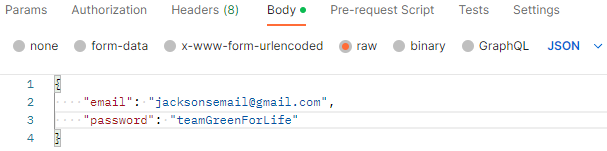
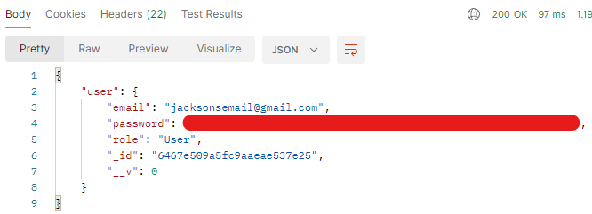

# Creating A New User

In order to use the dashboard, you must first create a new user or log in to an existing account. There are two account types: users and admins. Currently, only user type accounts can be created.

## Creating an account

Creating an account is easy. All you need is the latest code from the backend repository and a way to send the request (Postman is recommended). To create an account:

1. Open the backend repo and get the latest changes using `git pull`
2. Start the backend server by running `npm run dev`
3. Once the server has started (it will say “server started on port 8085”), open Postman and create a new request
4. Create a post request and use the following link: [http://localhost:8085/api/user/createUser](http://localhost:8085/api/user/createUser)
5. Go to the “Body” tab and add an email and a password. Make sure to note your password somewhere, as it will be hashed in the database and unreadable. My body looks like the following:

1. Send the request. If successful, the response should look something like this, but the password will be encrypted:

