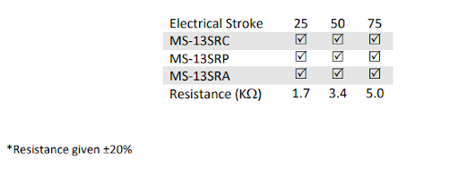
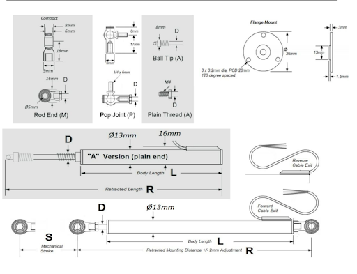
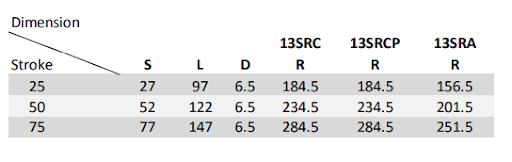
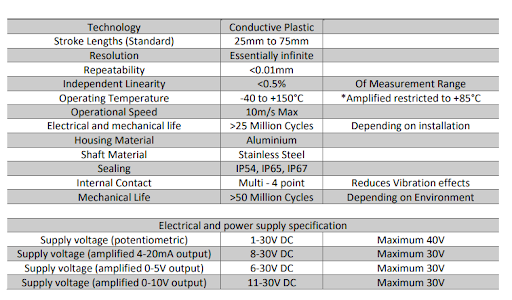
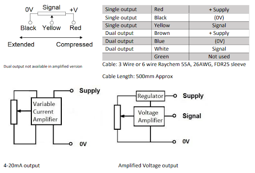
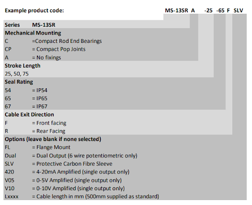

# Strainsense: MS-13SR LINEAR POTENTIOMTER

## Links:

1. Potentiometer Link on strainsense ([https://www.strainsense.co.uk/product/ms-13sr-linear-potentiometer/](https://www.strainsense.co.uk/product/ms-13sr-linear-potentiometer/)) 
2. Descriptive PDF file on the potentiometer ([https://www.strainsense.co.uk/client-storage/uploads/products/1674473069-MS-13SR%20Compact%20Spring%20advance%20Linear%20Potentiometers-A.pdf](https://www.strainsense.co.uk/client-storage/uploads/products/1674473069-MS-13SR%20Compact%20Spring%20advance%20Linear%20Potentiometers-A.pdf))  

## Description

The MS-13SR (Spring Return) series of linear potentiometers are designed to withstand the harsh environments of motorsport, testing and industrial applications. Using proven ‘Conductive Plastic’ technology, the sensors offer high performance and reliability at operational temperatures up to +150°C 

The rugged, yet compact 13mm diameter MS-13SR is available with stroke lengths from 25mm up to 75mm, flange mount, a choice of potentiometer and regulated analogue outputs. 

Standard versions available – See MS-13 datasheet. 

Accessories available in our Accessory Datasheet such as, protective sleeve, body clamps etc.

## Measurement ranges

>>>>>  gd2md-html alert: inline image link here (to images/me). Store image on your image server and adjust path/filename/extension if necessary.  (<a href="#">Back to top</a>)(<a href="#gdcalert2">Next alert</a>) >>>>> 

## Diagrams and Dimensions

>>>>>  gd2md-html alert: inline image link here (to images/image2.png). Store image on your image server and adjust path/filename/extension if necessary.  (<a href="#">Back to top</a>)(<a href="#gdcalert3">Next alert</a>) >>>>> 

>>>>>  gd2md-html alert: inline image link here (to images/image3.png). Store image on your image server and adjust path/filename/extension if necessary.  (<a href="#">Back to top</a>)(<a href="#gdcalert4">Next alert</a>) >>>>> 

## Specifications

>>>>>  gd2md-html alert: inline image link here (to images/image4.png). Store image on your image server and adjust path/filename/extension if necessary.  (<a href="#">Back to top</a>)(<a href="#gdcalert5">Next alert</a>) >>>>> 

## Electrical Characteristics

>>>>>  gd2md-html alert: inline image link here (to images/image5.png). Store image on your image server and adjust path/filename/extension if necessary.  (<a href="#">Back to top</a>)(<a href="#gdcalert6">Next alert</a>) >>>>> 

## Ordering Information

>>>>>  gd2md-html alert: inline image link here (to images/image6.png). Store image on your image server and adjust path/filename/extension if necessary.  (<a href="#">Back to top</a>)(<a href="#gdcalert7">Next alert</a>) >>>>> 

## Key Features

* Rugged construction
* Compact design
* Long life
* Spring loaded
* Excellent Linearity
* Regulated Output Options
* Ranges from 0-25 mm to 0-75 mm
* 13 mm diameter housing
* Rugged construction
* Sealed to IP67

## Applications

* Motorsport control monitoring
* Vehicle and machine controls
* Structural monitroing