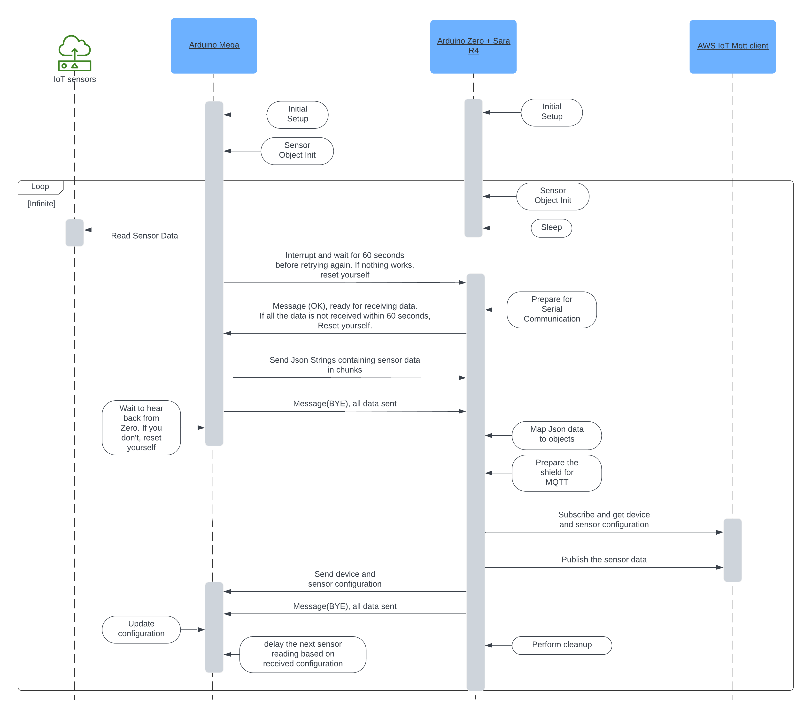
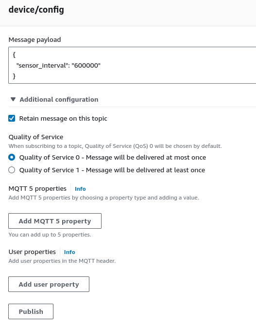
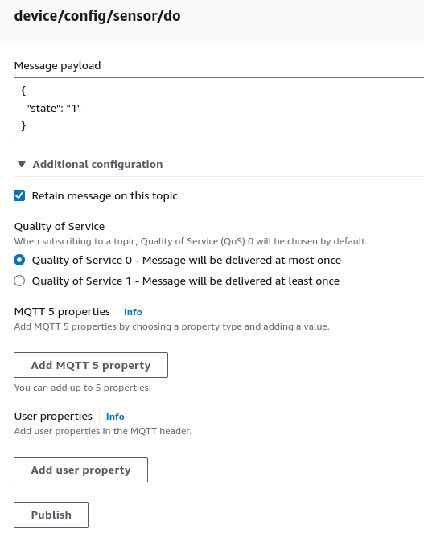

# Device Firmware Refactor
Repository: [device-firmware-refactor](https://github.com/BCIT-Reseach-Long-Term-ISSP/device-firmware-refactor/tree/main)

This repository currently generate mock data on the Mega, sends the data over to the Zero. Then the Zero uses the shield to subscribe to MQTT topics, get configuration from the cloud, and publish data to the mqtt topics as well. Finally, the zero sends the configurations back to the mega. After this, Zero goes to sleep, and mega wakes it up again whenever it wants to send sensor readings.
Arduino Zero + Sara R4 shield (communication device) is treated as a dumb device. What I mean is, Arduino Mega decides where it wants to send the data to and which topic does it want to get the data/configuration from.


## Bi-DIrenctional Communication sequence between Mega <-> Zero + Shield <-> AWS IoT


## Setup
1. **Sensor Reading Device:**
    - Setup Arduino Mega [Documentation](./mega_setup.md).
2. **Communication Device:**
    - Setup Arduino Zero + Sara R4 shield [Documentation](./zero_setup.md).
3. **Connect the sensor reading and communication device together:**
    ```
    +-------------+-----------------------------+
    | Mega (PIN)  | Zero/Shield (PIN)           |
    +-------------+-----------------------------+
    | 18 (TX1)    | 12 (Digital, Serial2, RX)   |
    | 19 (RX1)    | 10 (Digital, Serial2, TX)   |
    | 2  (PWM)    | 2  (Digital)                |
    +-------------+-----------------------------+
    ```
4. **Final Steps**:
    - Open 2 Serial Monitors in 2 windows of Arduino IDE. Make sure to select the proper board on each instance of the IDE.
    - Just so both the devices are in sync (not necessary), use the reset button to first reset Arduino Mega and then reset Arduino Zero.
    - Navigate to **AWS IoT** → **MQTT test client**, subscribe to **`#`** topic to see the messages being published.


## Local Environment
To setup your local development environment, in case you don't want to use scripts all the time, you'll have to setup your boards and programmers, either via arduino-cli or Arduino IDE. We provide the cli commands to setup your environment:

1. ```bash
        arduino-cli core update-index --additional-urls https://adafruit.github.io/arduino-board-index/package_adafruit_index.json
    ```
2. ```bash
        arduino-cli core install arduino:samd@1.8.13
    ```
3. ```bash
        arduino-cli core install arduino:avr@1.8.6
    ```
4. ```bash
        arduino-cli burn-bootloader -b "arduino:samd:arduino_zero_edbg" -p "<PORT>" -P "edbg"
    ```
    Example:
    ```bash
        arduino-cli burn-bootloader -b "arduino:samd:arduino_zero_edbg" -p "/dev/ttyACM0" -P "edbg"
    ```
5. Copy the libraries from `<PROJECT_ROOT>/<zero/mega>/build_sources/artifacts/libraries/*` to `~/Arduino/libraries/` manually.

## Where to find the required libraries, if needed
<table>
  <tr>
    <th>Library</th>
    <th>Version</th>
    <th>Installation</th>
  </tr>
  <tr>
    <td>PubSubClient</td>
    <td>2.8</td>
    <td>Arduino IDE Library Manager</td>
  </tr>
  <tr>
    <td>Arduino Low Power</td>
    <td>1.2.2</td>
    <td>Arduino IDE Library Manager</td>
  </tr>
  <tr>
    <td>RTCZero</td>
    <td>1.6.0</td>
    <td>Arduino IDE Library Manager</td>
  </tr>
  <tr>
    <td>ArduinoJson</td>
    <td>6.21.4</td>
    <td>Arduino IDE Library Manager</td>
  </tr>
  <tr>
    <td>Sparkfun LTE Shield Arduino Library</td>
    <td>1.3.0</td>
    <td>Download zip from <a href="https://github.com/sparkfun/SparkFun_LTE_Shield_Arduino_Library/archive/refs/heads/master.zip" target="_blank">GitHub</a> and add to Arduino IDE under <strong>Sketch</strong> → <strong>Include Library</strong> → <strong>Add .ZIP Library</strong></td>
  </tr>
  <tr>
    <td>SimpleNB</td>
    <td>latest</td>
    <td>Download zip from <a href="https://github.com/techstudio-design/SimpleNB/archive/refs/heads/master.zip" target="_blank">GitHub</a> and add to Arduino IDE under <strong>Sketch</strong> → <strong>Include Library</strong> → <strong>Add .ZIP Library</strong></td>
  </tr>
</table>


## Updating device variables
There are a lot of variables that you can play around with to cusomize the device. These variables, for the most part can be found in:
- mega/main/defines.h
- zero/main/defines.h

## General Information
### publish topics:
- Topic format: `<prefix>/<suffix>`
- prefix: `device/reading/sensor/`. (Subject to change)
- suffix: (Subject to change)
    - ch4
    - co2
    - cond
    - do
    - flw
    - lvl
    - ph
    - tmp
    - tds
    - tbd
- publish JSON format:
    ```json
    {
    "value": "<value>"
    }
    ```

### Device Configuration Topic:
- Topic: `device/config`
- Format: (value is in milliseconds and of type string)
    ```json
    {
    "sensor_interval": "<value>"
    }
    ```
- Please ensure that for the Communication Device (Zero + Sara R4) to successfully get the the configuration, the published configuration on the MQTT config topic should be a retained message.<br>


### Sensor Configuration Topic:
- Topic format: `<prefix>/<suffix>`
- prefix: `device/config/sensor/`. (Subject to change)
- suffix: (Subject to change)
    - ch4
    - co2
    - cond
    - do
    - flw
    - lvl
    - ph
    - tmp
    - tds
    - tbd
- Format: (value is either `0` (off), or `1` (on) and is of type string)
    ```json
    {
    "state": "<value>"
    }
    ```
- Please ensure that for the Communication Device (Zero + Sara R4) to successfully get the configuration, the published configuration on the MQTT config topic should be a retained message.<br>
